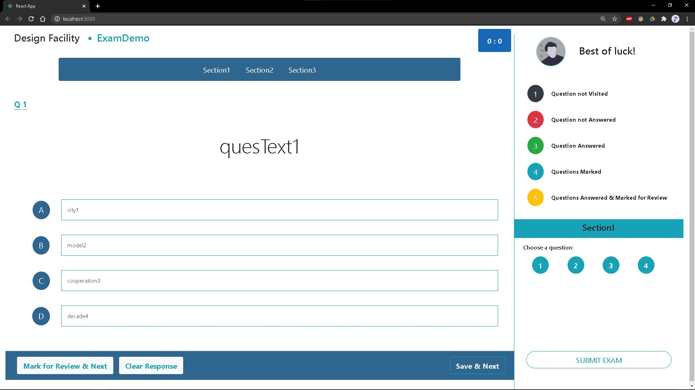

# React Exam Webpage

    It accepts data from API and displays it to the user, 
    accepts input from the user and shows the final result.

### Build by using

> [ReactJs](https://reactjs.org/)

> [bootstrap](https://getbootstrap.com/)

> Javascript

### ScreenShots



### Gratification

```
    I want to show my gratitude to all the developers 
    who have worked hard in building such amazing 
    open source liberaries like bootstrap and others,
    Because of you all developers like myself
    who are still learning, can build things 
    so much better, easily and seamlessly.
                Thank you so much.
```
